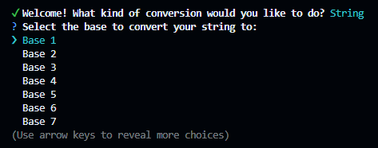

<h1 align="center" style="font-size: 2.5em; color: #4A90E2;">base-string-converter</h1>

  
  
  
  
  
  
  
  
  
  
  
  
  
  
  

  A versatile tool for converting data between various base encodings, including Base64, Base32, Base58, and more. Available as a command-line tool and a web application, it empowers users to quickly encode, decode, or convert data seamlessly.

> **Note:** The main functionality of this tool is now stable and fully operational. However, it is still in active development, and additional features and updates may be added in the future. Please expect occasional changes as development continues.

<h2 style="color: #4A90E2;">Table of Contents</h2>
<ul>
  <li><a href="#features">Features</a></li>
  <li><a href="#installation">Installation</a></li>
  <li><a href="#usage">Usage</a></li>
  <li><a href="#code-example">Code Example</a></li>
  <li><a href="#contribution">Contribution</a></li>
  <li><a href="#license">License</a></li>
  <li><a href="#learn-more">Learn More</a></li>
</ul>

<h2 align="center" id="features" style="color: #4A90E2;">Features</h2>

<ul>
    <li>🔄 <strong>Seamless Conversion:</strong> Convert between numeral systems and base encodings (e.g., Base64 to Base32, Base58 to Base64).</li>
    <li>🔤 <strong>String Encoding:</strong> Effortlessly transform strings into base encodings (e.g., text to Base64).</li>
    <li>🧩 <strong>Decoding Made Easy:</strong> Decode base encodings back into readable text (e.g., Base64 to plain text).</li>
    <li>⚡ <strong>Intuitive Interface:</strong> Simple and user-friendly command-line prompts for quick and hassle-free usage.</li>
    <li>🚀 <strong>High Performance:</strong> Lightweight, fast, and optimized for efficiency.</li>
    <li>🔒 <strong>Versatile Utility:</strong> Perfect for data transformations, encoding workflows, and cryptographic tasks.</li>
    <li>💾 <strong>Persistent History:</strong> The conversion history is saved in a JSON file, allowing you to revisit past conversions at any time.</li>
</ul>

<h2 align="center" id="installation" style="color: #4A90E2;">Installation</h2>

To install this package, follow these steps:

<ol>
  <li>
    <strong>Clone the repository:</strong>
     First, clone the repository to your local machine to create a copy of it:
    <pre><code>git clone https://github.com/anonymByte-404/base-string-converter.git</code></pre>
  </li>
  <li>
    <strong>Navigate to the project directory:</strong>
     After cloning, move into the project directory where all the files are located:
    <pre><code>cd base-string-converter</code></pre>
  </li>
  <li>
    <strong>Install dependencies using <code>npm</code>:</strong>
     Install the required dependencies for the project by running:
    <pre><code>npm install</code></pre>
    This will install all the necessary libraries and packages specified in the <code>package.json</code> file.
  </li>
  <li>
    <strong>Run the application:</strong>
     Once the dependencies are installed, start the application using the following command:
    <pre><code>npm start</code></pre>
    This will launch the application, and you should be able to use it as intended.
  </li>
</ol>

<h2 align="center" id="usage" style="color: #4A90E2;">Usage</h2>

<ol>
  <li>
    <strong>Select the type of conversion:</strong>
     
Choose the type of conversion you want to perform (e.g., String, Base).

    
  </li>
  <li>
    <strong>Choose the target base:</strong>
     
Select the target numeral system for your conversion (e.g., Base64, Base32, etc.).</ps>
     
  </li>
  <li>
    <strong>Input the string to convert:</strong>
     
Provide the string or data you wish to convert into the selected base or encoding.

    
  </li>
  <li>
    <strong>View the conversion output:</strong>
     
Check the conversion result and decide whether to proceed with further actions, such as repeating the conversion or returning to the main menu.

    
  </li>
</ol>

<h2 align="center" id="code-example" style="color: #4A90E2;">Code Example</h2>

Below is an illustrative example of how you could use this tool programmatically in a Node.js application:

<pre><code>// A module is currently being developed. Stay tuned!</code></pre>

> [!Note]
> This is not the actual code, but an illustration designed to demonstrate how the CLI tool operates. It serves as an example to show the general behavior and flow of the tool, rather than the complete or exact implementation.

<h2 align="center" id="contribution" style="color: #4A90E2;">Contribution</h2>

Contributions are welcome! Here's how you can help:

<ol>
  <li>
    <strong>Fork the repository.</strong>
     Go to the repository page on GitHub and click the <strong>"Fork"</strong> button to create your own copy.
  </li>
  <li>
    <strong>Clone your Fork</strong>
     After forking the repository, <code>clone</code> it to your local machine:
    <pre><code>git clone https://github.com/anonymByte-404/base-string-converter.git</code></pre>
  </li>
  <li>
    <strong>Create a new branch for your feature or bug fix:</strong>
     Create a new <code>branch</code> so you can work on your changes without affecting the main branch:
    <pre><code>git checkout -b feature/your-feature-name</code></pre>
  </li>
  <li>
    <strong>Make your changes and commit:</strong>
     After making your changes, <code>commit</code> them with a meaningful message:
    <pre><code>git commit -m "Add new feature"</code></pre>
  </li>
  <li>
    <strong>Push your changes:</strong>
     Push your changes back to your forked repository:
    <pre><code>git push origin feature/your-feature-name</code></pre>
  </li>
  <li>
    <strong>Create a Pull Request:</strong>
     Finally, go to the original repository on GitHub and create a <strong>Pull Request</strong> to propose your changes.
  </li>
</ol>

<h2 align="center" id="license" style="color: #4A90E2;">License</h2>

This project is licensed under the <strong>AGPL-3.0 License</strong>. See the <a href="LICENSE">LICENSE</a> file for more details.

<h2 align="center" id="learn-more" style="color: #4A90E2;">Learn More</h2>

  Explore the following resources to deepen your understanding of numeral systems, base encodings, and their applications:

<ul>
  <li><a href="https://en.wikipedia.org/wiki/Numeral_system" target="_blank">Overview of Numeral Systems on Wikipedia</a></li>
  <li><a href="https://en.wikipedia.org/wiki/Base_(numeration)" target="_blank">Understanding Base (Numeration) on Wikipedia</a></li>
  <li><a href="https://en.wikipedia.org/wiki/Base64" target="_blank">Base64 Encoding on Wikipedia</a></li>
  <li><a href="https://en.wikipedia.org/wiki/Base32" target="_blank">Base32 Encoding on Wikipedia</a></li>
  <li><a href="https://en.wikipedia.org/wiki/Base58" target="_blank">Base58 Encoding on Wikipedia</a></li>
  <li><a href="https://en.wikipedia.org/wiki/Base85" target="_blank">Base85 Encoding on Wikipedia</a></li>
  <li><a href="https://en.wikipedia.org/wiki/Hexadecimal" target="_blank">Hexadecimal (Base16) on Wikipedia</a></li>
  <li><a href="https://en.wikipedia.org/wiki/Octal" target="_blank">Octal (Base8) on Wikipedia</a></li>
  <li><a href="https://en.wikipedia.org/wiki/Encoding" target="_blank">Encoding and Decoding: An Overview on Wikipedia</a></li>
  <li><a href="https://www.ietf.org/rfc/rfc4648.txt" target="_blank">RFC 4648: Base Encoding Schemes</a></li>
  <li><a href="https://www.baeldung.com/java-base64-encoding" target="_blank">Base64 Encoding and Decoding in Java</a></li>
  <li><a href="https://www.npmjs.com/package/base64-js" target="_blank">base64-js: A JavaScript Library for Base64 Encoding</a></li>
</ul>

