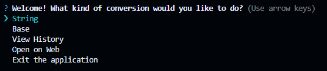

<h1 align="center">base-string-converter</h1>

<p align="center"><i>A versatile tool for converting data between various base encodings, including Base64, Base32, Base58, and more. Available as a command-line tool and a web application, it empowers users to quickly encode, decode, or convert data seamlessly.</i></p>

> [!Note]
> The main functionality of this tool is now stable and fully operational. However, it is still in active development, and additional features and updates may be added in the future. Please expect occasional changes as development continues.

<h2>Table of Contents</h2>
<ul>
  <li><a href="#features">Features</a></li>
  <li><a href="#installation">Installation</a></li>
  <li><a href="#usage">Usage</a></li>
  <li><a href="#code-example">Code Example</a></li>
  <li><a href="#contribution">Contribution</a></li>
  <li><a href="#license">License</a></li>
</ul>

---

<h2 align="center" id="features">Features</h2>

<ul>
    <li>🔄 <strong>Seamless Conversion:</strong> Convert between numeral systems and base encodings (e.g., Base64 to Base32, Base58 to Base64).</li>
    <li>🔤 <strong>String Encoding:</strong> Effortlessly transform strings into base encodings (e.g., text to Base64).</li>
    <li>🧩 <strong>Decoding Made Easy:</strong> Decode base encodings back into readable text (e.g., Base64 to plain text).</li>
    <li>⚡ <strong>Intuitive Interface:</strong> Simple and user-friendly command-line prompts for quick and hassle-free usage.</li>
    <li>🚀 <strong>High Performance:</strong> Lightweight, fast, and optimized for efficiency.</li>
    <li>🔒 <strong>Versatile Utility:</strong> Perfect for data transformations, encoding workflows, and cryptographic tasks.</li>
    <li>💾 <strong>Persistent History:</strong> The conversion history is saved in a JSON file, allowing you to revisit past conversions at any time.</li>
</ul>

---

<h2 align="center" id="installation">Installation</h2>

<p align="left">To install this package, follow these steps:</p>

1. Clone the repository:

   ```bash
   git clone https://github.com/your-username/base-string-converter.git
   ```

2. Navigate to the project directory:

   ```bash
   cd base-string-converter
   ```

3. Install dependencies using npm:

   ```bash
   npm install
   ```

4. Run the application:
   ```bash
   npm start
   ```

<h2 align="center" id="usage">Usage</h2>

1. <strong>Select the type of conversion:</strong>
  <br>Choose the type of conversion you want to perform (e.g., String, Base).
   <br>

2. <strong>Choose the target base:</strong>
  <br>Select the target numeral system for your conversion (e.g., Base64, Base32, etc.).
   <br>

3. <strong>Input the string to convert:</strong>
  <br>Provide the string or data you wish to convert into the selected base or encoding.
   <br>

4. <strong>View the conversion output:</strong>
  <br>Check the conversion result and decide whether to proceed with further actions, such as repeating the conversion or returning to the main menu.
   <br>

<h2 align="center" id="code-example">Code Example</h2>

<p align="center">Below is an illustrative example of how you could use this tool programmatically in a Node.js application:</p>

```typescript
import inquirer from 'inquirer'

const baseChoices: string[] = Array.from(
  { length: 64 },
  (_, i) => `Base ${i + 1}`
)

const main = (): void => {
  inquirer
    .prompt([
      {
        type: 'list',
        name: 'conversionType',
        message: 'Select the type of conversion you want to perform:',
        choices: ['String Conversion', 'Base Conversion'],
      },
    ])
    .then((answers: { conversionType: string }) => {
      if (answers.conversionType === 'String Conversion') {
        return stringConverter(
          inquirer,
          main,
          baseChoices
        )
      } else {
        inquirer
          .prompt([
            {
              type: 'list',
              name: 'selectedBase',
              message: 'Choose the target base for conversion:',
              choices: baseChoices,
            },
          ])
          .then((answers: { selectedBase: string }) => {
            switch (answers.selectedBase) {
              case 'Base 2':
                return binaryConverter(
                  inquirer,
                  main
                )
              default:
                console.log(
                  `Conversions for ${answers.selectedBase} are currently not supported.`
                )
            }
          })
          .catch((error: unknown) => {
            console.error('An error occurred during base selection:', error)
          })
      }
    })
    .catch((error: unknown) => {
      console.error('An error occurred during the initial prompt:', error)
    })
}

main()
```

> [!NOTE]
> This is not the actual code, but an illustration designed to demonstrate how the CLI tool operates. It serves as an example to show the general behavior and flow of the tool, rather than the complete or exact implementation.

<h2 align="center" id="contribution">Contribution</h2>

<p align="left">Contributions are welcome! Here's how you can help:</p>

1. Fork the repository.

2. Create a new branch for your feature or bug fix:

   ```bash
   git checkout -b feature/your-feature-name
   ```

3. Make your changes and commit:

   ```bash
   git commit -m "Add your commit message here"
   ```

4. Push to your fork:

   ```bash
   git push origin feature/your-feature-name
   ```

5. Open a pull request on the main repository.

<h2 align="center" id="license">LICENSE</h3>
<p align="center">This project is licensed under the AGPL-3.0 License. See the <a href="LICENSE">LICENSE</a> file for more details.</p>
